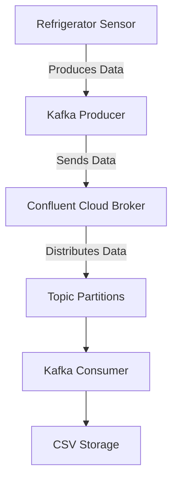

# Consumers with Confluent Kafka Python on Confluent Cloud

## Introduction

In this section, we’ll explore how to create and configure a consumer using the Python library confluent_kafka to read messages from a Kafka broker hosted on Confluent Cloud. The goal is to consume messages from a topic that simulates temperature readings from a refrigerator sensor.

## Basic concepts

- **Consumer**: Applications that read (consume) data from Kafka.

## Architecture diagram



## Consumer code

Create a file named `kafka_consumers.py` with the following content:

```python
from confluent_kafka import Consumer, KafkaError
from dotenv import load_dotenv
import os
import csv

load_dotenv()

# Producer configuration
conf = {
    'bootstrap.servers': os.getenv('BOOTSTRAP_SERVERS'),
    'sasl.mechanisms': 'PLAIN',
    'security.protocol': 'SASL_SSL',
    'sasl.username': os.getenv('SASL_USERNAME'),
    'sasl.password': os.getenv('SASL_PASSWORD'),
    'group.id': 'python-consumer-group',
    'auto.offset.reset': 'earliest'
}

consumer = Consumer(**conf)

# Topic subscription
topic = os.getenv('TOPIC')
consumer.subscribe([topic])

# Function to process messages
def consume_messages():
    # CSV file name
    script_dir = os.path.dirname(os.path.abspath(__file__))  # Current script directory
    csv_file = os.path.join(script_dir, 'messages.csv')  # Full path to the CSV file
    
    # Open the CSV file in write mode
    with open(csv_file, mode='w', newline='') as file:
        writer = csv.writer(file)
        writer.writerow(['Key', 'Value'])  # Write header to the CSV
        
        try:
            while True:
                msg = consumer.poll(1.0)  # Wait up to 1 second for a new message
                # Display the received message
                if msg is None:  # If no message was received
                    continue
                if msg.error():  # If there was an error receiving the message
                    continue
                key = msg.key().decode('utf-8')
                value = msg.value().decode('utf-8')
                print(f"Received message: Key: {key}, Value: {value}")
                # Write the message to the CSV
                writer.writerow([key, value])
        except KeyboardInterrupt:
            pass
        finally:
            print("Closing consumer.")
            consumer.close()

if __name__ == "__main__":
    consume_messages()
```

## Running the consumer

To run the consumer and start reading messages from the topic, use the following command:

```bash
python kafka_consumers.py
```

The received messages will be printed to the console and saved in a `messages.csv` file located in the same directory as the Python script.

## Conclusion

With this guide, you’ve configured and run a Kafka consumer using Python and the confluent_kafka library. This allows you to read and process messages from a Kafka topic hosted on Confluent Cloud, storing the consumed data in a CSV file for later analysis.