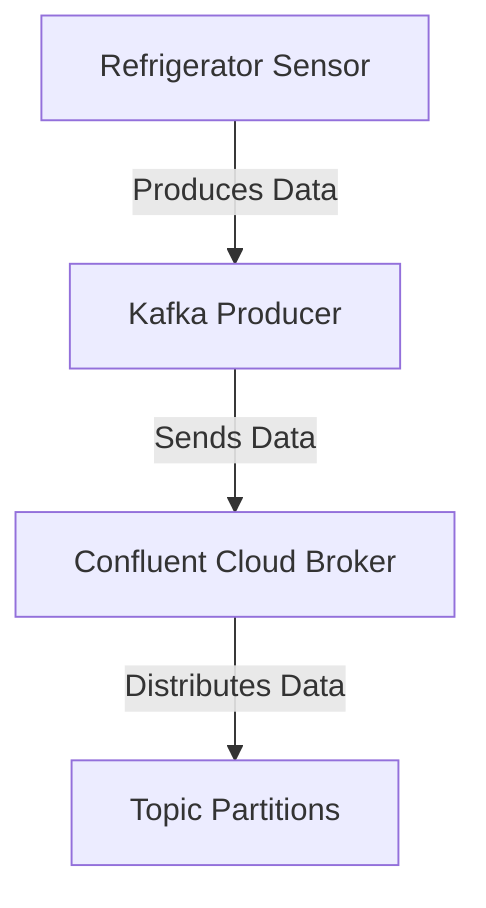
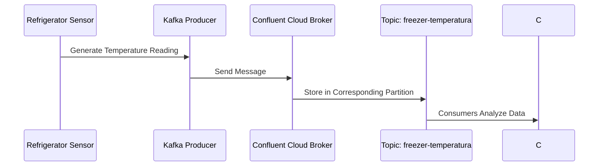

### Producers with Confluent Kafka Python on Confluent Cloud

### Introduction

In this section, we’ll explore how to create and configure a producer using the Python confluent_kafka library to send messages to a Kafka broker hosted on Confluent Cloud. Our goal is to simulate a refrigerator sensor for Ambev, enabling temperature monitoring of the freezer to ensure it stays at the ideal temperature.

### Basic concepts

- **Producer**: Applications that send (produce) data to Kafka.

### Architecture diagram



### Producer structure

In Kafka, producers are responsible for sending messages to specific topics. We’ll use the confluent_kafka library to create and configure a Python producer.

### Library installation

First, install the required libraries `confluent_kafka`:

```bash
pip install confluent_kafka python-dotenv
```

### Producer configuration for confluent cloud

#### Steps to obtain the required configuration

1. **Get the bootstrap server**:
   - In the Confluent Cloud Console, go to your Kafka cluster and find the bootstrap server address.

2. **Get the API credentials (API Key and Secret)**:
   - In the Confluent Cloud Console, go to "API keys" and create a new API key. Note the key and secret.

3. **Create the topic using the confluent cloud CLI**:

```bash
confluent kafka topic create freezer-temperatura --partitions 3 --cluster lkc-k08pop
```

### `.env` File

Create a `.env` file in the same directory as your Python script and add the following lines:

```plaintext
BOOTSTRAP_SERVERS=pkc-921jm.us-east-2.aws.confluent.cloud:9092
SASL_USERNAME=6A32O4CMIOYJRROP
SASL_PASSWORD=1brXQVYpXLX5Av3thRATeC3UWQVtIIfiAfVkWXWG8qxmSPcAPhRtW0d/6Y5CPG9L
CLIENT_ID=PrimeiroProducer
TOPIC=freezer-temperatura
```

### Configuration example

Here is a full example of how to configure and use the producer in Python with the confluent_kafka library for Confluent Cloud:

```python
from confluent_kafka import Producer
from dotenv import load_dotenv
import os
import random
import time

load_dotenv()

# Producer configuration
conf = {
    'bootstrap.servers': os.getenv('BOOTSTRAP_SERVERS'),
    'sasl.mechanisms': 'PLAIN',
    'security.protocol': 'SASL_SSL',
    'sasl.username': os.getenv('SASL_USERNAME'),
    'sasl.password': os.getenv('SASL_PASSWORD'),
    'client.id': os.getenv('CLIENT_ID')
}

# Creation of producer
producer = Producer(**conf)

# Callback function to delivery messages
def delivery_report(err, msg):
    if err is not None:
        print(f"Message delivery failed: {err}")
    else:
        print(f"Message delivered to {msg.topic()} [{msg.partition()}]")

# Producing messages simulating a refrigerator sensor
topic = os.getenv('TOPIC')
for i in range(10):
    temperature = random.uniform(-5, 5)  # Ambient temperature between -5 and 5 degrees Celsius
    key = f"sensor{i % 3}"  # Use different keys to distribute across partitions
    producer.produce(topic, key=key, value=f"{temperature:.2f}", callback=delivery_report)
    producer.poll(0)
    time.sleep(1)  # Simulate temperature reading every second


# Wait until all messages are delivered
producer.flush()
```

### Message production flow diagram



### How the producer chooses the partition

The producer decides which partition to send each message to, either by round-robin (no key) or by computing the target partition using a key hash.


1. **Round-Robin**:
   - Messages without a key are distributed round-robin across partitions.

2. **Key Hash**:
   - Messages with a key have their destination partition calculated using the hash of the key.

### Internal producer behavior

- **Connection pool management**: The producer manages connection pools to optimize communication with the cluster..
- **Network buffering**: Messages are buffered before being sent to brokers.
- **Message acknowledgement**: The producer waits for acknowledgments from brokers to free up buffer space.
- **Message retries**: Retries occur if a message fails to deliver.

### Recommendations

To truly understand how producers work, it's highly recommended to write and run your own code. See the API in action, type the commands yourself, and observe Kafka’s behavior.

### Conclusion

Producers are a fundamental part of Kafka, enabling efficient and scalable data ingestion into the cluster. Understanding how to configure them and how they interact with partitions is key to making the most of Apache Kafka.

### Running the script

To run the script, ensure the .env file is in the same directory, then execute:

```bash
python kafka_producers.py
```

This will start the Kafka producer, sending simulated temperature readings to the freezer-temperatura topic on Confluent Cloud.

### Reading the generated values

```bash
confluent kafka topic consume freezer-temperatura --cluster lkc-k08pop --from-beginning
```